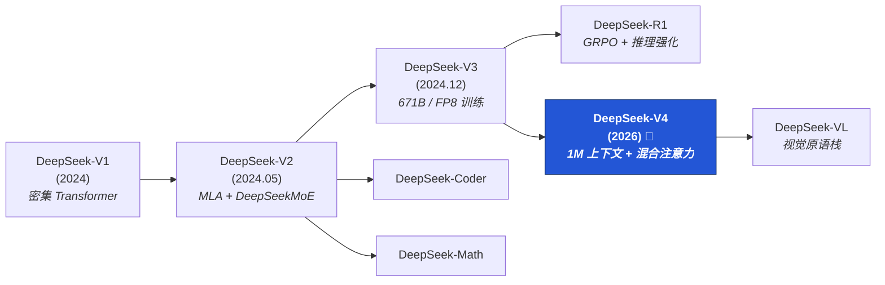

import { Card, CardGrid, LinkCard, Aside } from '@astrojs/starlight/components';

<Aside type="tip" title="先看哪一篇？">
  如果你只有 30 分钟，建议直接读 [V4 研究深度解析](/deepseek/v4-research/) 的前两节；
  对架构本身感兴趣再深入 [混合注意力](/deepseek/hybrid-attention/)。
</Aside>

## 为什么单独开 DeepSeek 专题

DeepSeek 是少数把 **架构创新 + 工程化 + 训练成本控制** 三件事同时讲清楚的开源团队：

- **架构层**：MLA、混合注意力（SWA/CSA/HCA）、Multi-Token Prediction
- **训练层**：MoE 路由稳定化、FP8 混合精度、PP/EP/DP 三层并行
- **后训练**：GRPO、Open-Process Distillation（OPD）、reasoning 强化
- **多模态**：DeepSeek-VL 的视觉原语 + 推理闭环

这些技术点几乎全都被工业界其他团队**直接复用**了，所以读 DeepSeek 系列论文 = 一次性补齐当前开源 LLM 的工程基线。

## 家族族谱

> 上图是 Mermaid 渲染的活图：你可以右键查看 SVG，或者去 [`/deepseek/overview.mdx`](https://github.com/Haimbeau1o/Group-Reading-Wiki/blob/main/src/content/docs/deepseek/overview.mdx) 看源码改一改。

## 当前已上线文章

<CardGrid>
  <LinkCard
    title="V4 研究深度解析"
    description="架构、训练管线、OPD、推理服务的完整剖析（约 6000 字）"
    href="/deepseek/v4-research/"
  />
  <LinkCard
    title="混合注意力机制"
    description="SWA + CSA + HCA 三路并联如何实现 1M context（约 4000 字）"
    href="/deepseek/hybrid-attention/"
  />
  <LinkCard
    title="视觉原语"
    description="DeepSeek-VL 的视觉编码栈与多模态推理闭环（约 5500 字）"
    href="/deepseek/visual-primitives/"
  />
</CardGrid>

## 推荐阅读顺序

<CardGrid>
  <Card title="① 先看 V4 总览" icon="open-book">
    建立大局观：V4 想解决什么、用了哪些招、效果如何。
  </Card>
  <Card title="② 再深挖混合注意力" icon="puzzle">
    理解 V4 最硬核的架构创新，看完你会明白为什么不是单纯堆 KV cache。
  </Card>
  <Card title="③ 然后看 OPD 训练管线" icon="setting">
    （在 V4 研究文中）训练-推理 co-design 是 V4 的另一条主线。
  </Card>
  <Card title="④ 最后看视觉原语" icon="document">
    多模态侧的延伸，理解 DeepSeek 怎么把"看图"也变成 token 流。
  </Card>
</CardGrid>

## 待补充（欢迎认领）

- [ ] DeepSeek-V2 / V3 历代架构对比
- [ ] DeepSeek-R1 的 GRPO 训练细节
- [ ] DeepSeek-Coder & Math 的数据 pipeline
- [ ] V4 推理服务（vLLM/SGLang）部署实战

> 想认领某一项？去 [如何参与共读](/how-to-contribute/#提名一篇论文) 看流程。
